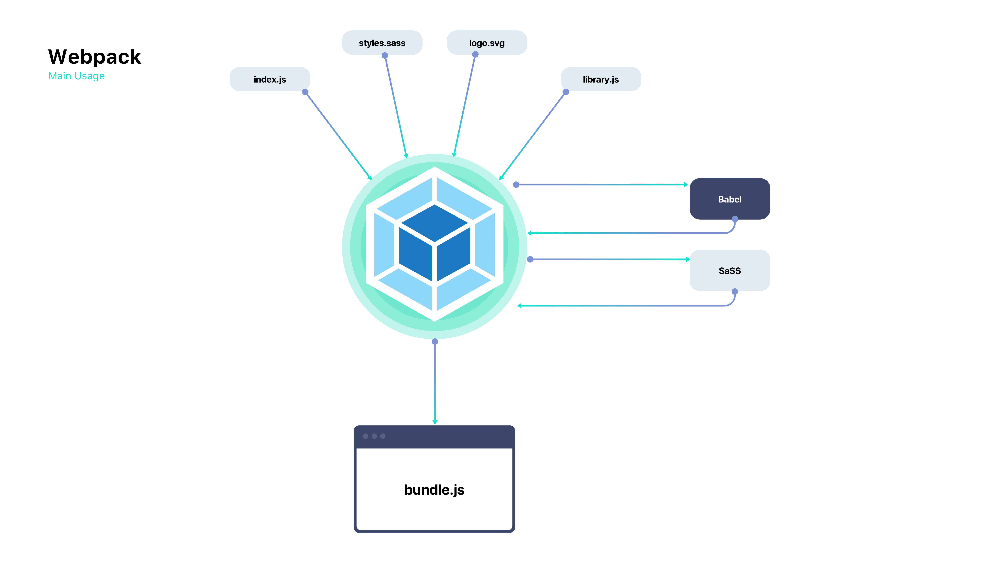

# Webpack with Babel

In this template we will check an ECMAScript 6 (Javascript 6) app with retrocompatibility to older versions thanks to Babel.

## Requirements

* [Node](https://nodejs.org/en/)


## Introduction

* **[Webpack](https://webpack.js.org)** -> Webpack is a bundler for modules. Main purpose is to bundle JavaScript modules in a browser.
* **[Babel](https://babeljs.io)** -> Javascript compiler, tansform modern Javascript into older versions.

## Goal

The Goal of this application is to bundle all the files in development process to a single file called **bundle.js** which will be deployed as a single file with retrocompatibility.



## Setup

1. Download node and run the following command

```
npm install
```

2. Develop your project

You can start to develop your project, use the ```index.html```, ```index.js```, and ```styles.scss``` files to start the development process. These files, alongside all the imports will be later bundled and compiled onto a minimize version in the ```./dist/*``` folder.

3. Livewatch

To start livewatch just run ```npm run start:dev```.

## Deployment

To create a production build:

```
npm run build-prod
```

To create a development build:

```
npm run build-dev
```
